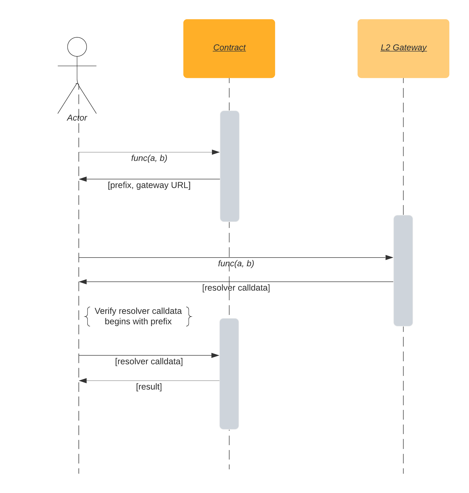

# L2 Gateway Demo
This repository contains the components necessary for a demonstration of the "l2 gateway" proto-standard.

## Usage
```
# Run a local ganache server in deterministic mode
ganache-cli --deterministic &
# Deploy the example contract
cd contract && npm install && truffle deploy --network=development && cd ..
# Start the demo l2 gateway
cd gateway && npm install && npm run serve & && cd ..
# Serve up the demo app on port 8000
cd caller && python -m SimpleHTTPServer && cd ..
```

Import one of addresses which constructed MerkleTree (eg: `0x90F8bf6A479f320ead074411a4B0e7944Ea8c9C1` which is one of available accounts in Ganache if you started it with `--deterministic`) into Metamask/your wallet and point the network to `localhost`.

Open your browser on localhost:8000.
If all setup successfull, you should see `Your balance is 0 MERKLE tokens, with 23.7337513105314 available to claim.` message on the page.

## Components
### [Caller](caller)
A very simple webapp that demonstrates how to call l2 gateway functions. main.js implements the application
logic, while l2gateway.js implements the generic gateway call functionality.

### [Contract](contract)
An ERC20-compatible merkle-drop token contract that uses l2 gateway to allow callers to query their claimable
balances and to claim their tokens without the application needing to be aware of the implementation details.

### [Gateway](gateway)
A node-based gateway server that answers queries for l2 gateway function calls relating to the merkle-drop contract.

## Operation


Calling an l2 gateway function is a three-step process:

 1. Call the contract's "stub" function with the desired parameters - eg `claimableBalance(address)`. The function returns `prefix` and `url`.
 2. Make a POST request to the gateway server at `url` with the same calldata as in step 1. The server returns `callbackData`.
 3. Check that `callbackData` starts with `prefix`; if it does not, throw an error. This check prevents the gateway server from serving you the result of a different query than the one you requested.
 4. Call the contract with `callbackData`; the return value is the result of the call.

Sending a transaction follows the same process, but results in a transaction instead of a call in step 3.
